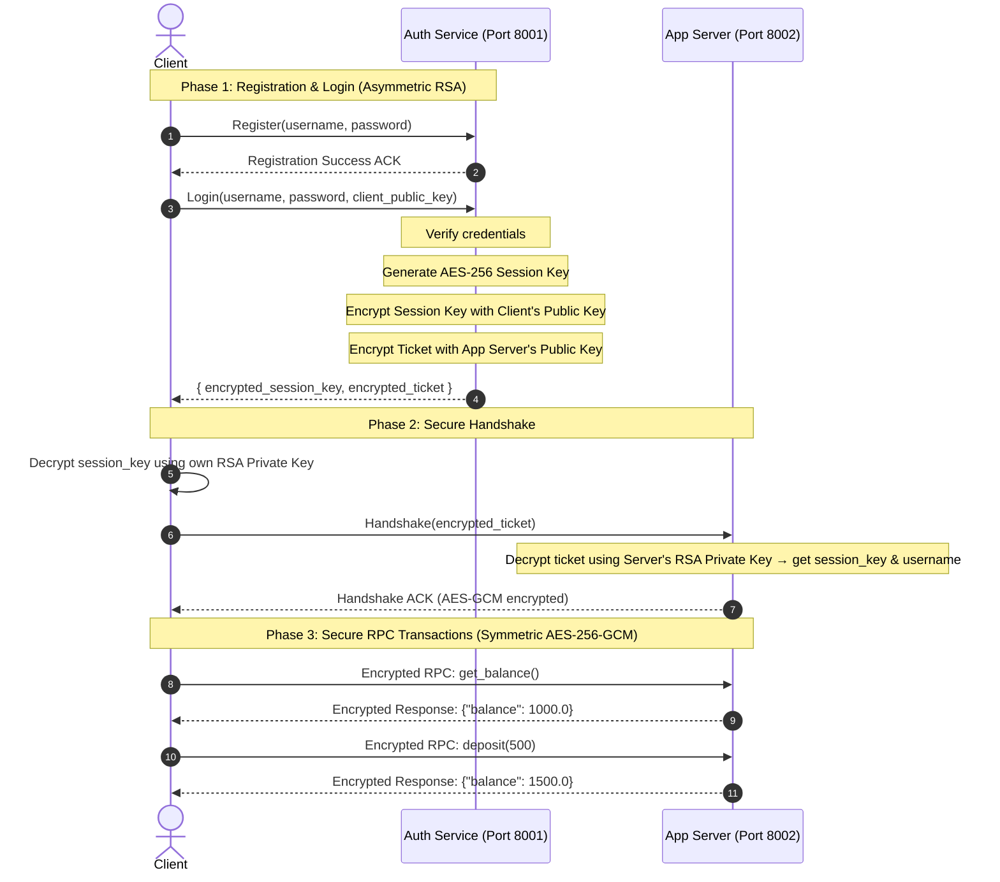

# Secure Distributed E-Wallet System
### 🏦 RPC over TCP | Hybrid RSA + AES-256-GCM Cryptosystem | Multi-Threaded Concurrency

A decentralized E-Wallet banking system built using **pure Python sockets**, multi-threaded connection handling, and a hybrid cryptographic design. This project was developed as part of the **Introduction to Parallel and Distributed Systems** course.

---

## 🏛️ Architecture Overview

The system employs a decentralized, three-tier service-oriented architecture:

```text
       [ Registration / Login ]           [ Ticket-based Handshake ]
Client ────────────────────────► Auth Service ─────────────────────► App Server
  │                              (Port 8001)                           (Port 8002)
  │                                                                        │
  └────────────────────────── Encrypted RPCs ──────────────────────────────┘
                             (AES-256-GCM Transactions)
```

1.  **Authentication Service (Port 8001)**: Handles user registration and login credentials. It operates as the centralized security coordinator, generating temporary symmetric session keys and App Server access tickets.
2.  **Application Server (Port 8002)**: The core banking engine. It hosts thread-safe wallet accounts and processes transactional RPC actions (balance, deposit, withdraw, transfer). It has no direct access to user passwords.
3.  **Client Application**: The user interface. It negotiates authentication with the Auth Service, performs the ticket handshake with the App Server, and presents an interactive CLI menu to transact securely.

---

## 🔒 Security Design: Hybrid Cryptosystem

To balance absolute security with high-performance distributed streaming, this system implements a **Hybrid Cryptosystem** (similar to TLS/HTTPS and Kerberos):



### Why Both Symmetric and Asymmetric?
*   **Asymmetric Encryption (RSA-2048)**: Used strictly for **authentication and key exchange**. RSA is computationally expensive and slow (up to 1,000x slower than AES) and has a strict payload size limit (~190 bytes). It is used only at startup to safely negotiate session secrets without requiring a pre-shared key.
*   **Symmetric Encryption (AES-256-GCM)**: Used for all **transactional RPC streaming**. GCM is a highly efficient Authenticated Encryption (AEAD) cipher. It encrypts payloads instantly and appends a 16-byte authentication tag to detect any socket packet tampering in transit.

---

## 🧵 Concurrency & Networking Controls

*   **Multi-Threading**: Both servers utilize `socketserver.ThreadingTCPServer`. Every incoming client connection is dynamically dispatched to an independent OS thread, allowing parallel request processing.
*   **Mutual Exclusion (Mutex Locking)**: Account balances are protected by a global thread lock (`wallet_db_lock`). This prevents race conditions (such as double-spend, read-write hazards, and lost updates) when multiple threads modify or read balances concurrently.
*   **TCP Stream Framing**: Because TCP is stream-oriented and lacks message boundaries, the system implements a **length-prefixed framing protocol** in `common/rpc_protocol.py`. Every payload is prefixed with a 4-byte big-endian unsigned integer indicating its exact byte length, preventing packet fragmentation or buffer merging issues.

---

## 📁 Directory Structure

```text
Project root/
├── common/                     # Core Shared Utilities
│   ├── crypto.py               # RSA asymmetric & AES-GCM symmetric wrappers
│   └── rpc_protocol.py         # Length-prefixed TCP socket framing
│
├── auth_service/               # Authentication Service (Port 8001)
│   └── auth_server.py          # Salted hashing user DB & Ticket generation
│
├── app_server/                 # Application Server (Port 8002)
│   └── server.py               # E-Wallet RPC services & atomic balance database
│
├── client/                     # Client CLI Application
│   └── client.py               # Auth flows, Handshakes, and interactive menu
│
├── keys/                       # Auto-generated RSA PEM key pairs (Auth, Server, Client)
│
├── requirements.txt            # Project dependencies (cryptography library)
└── run_demo.py                 # Integrated master system launcher
```

---

## 🚀 Getting Started

### 📋 Prerequisites
Ensure you have Python 3.10+ installed. The only external dependency is the `cryptography` library.

Install the dependency inside your environment:
```bash
pip install -r requirements.txt
```

---

### 🕹️ How to Run the System

#### Option 1: Master Launcher (Recommended)
The launcher handles starting all servers in the background and launches the interactive client menu in a single terminal console:

```bash
python run_demo.py
```
*Exiting the client console (Option 0) will automatically shut down the background servers and free their ports.*

#### Option 2: Run Separately (Three Terminals)
If you want to isolate logging output, open three separate terminal windows:

1.  **Terminal 1 (Auth Service)**:
    ```bash
    python auth_service/auth_server.py
    ```
2.  **Terminal 2 (App Server)**:
    ```bash
    python app_server/server.py
    ```
3.  **Terminal 3 (Client CLI)**:
    ```bash
    python client/client.py
    ```

---

## 💻 Using the Interactive Client CLI

When the client boots up, it presents a secure status dashboard and an interactive CLI menu:

```text
╔══════════════════════════════════════════════════╗
║              SECURE E-WALLET SYSTEM              ║
╠══════════════════════════════════════════════════╣
║  User: (none)                Status: OFFLINE     ║
╠══════════════════════════════════════════════════╣
║  1. Register New Account                         ║
║  2. Login                                        ║
║  3. Connect to App Server (Handshake)            ║
║  4. Check Balance                                ║
║  5. Deposit                                      ║
║  6. Withdraw                                     ║
║  7. Transfer                                     ║
║  8. Toggle Encryption Debug Mode [OFF]            ║
║  9. Disconnect & Logout                          ║
║  0. Exit                                         ║
╚══════════════════════════════════════════════════╝
```

### 💡 Suggested Demo Flow for Presentations
1.  **Register a User**: Choose **Option 1** and register a user (e.g., `alice` / `1234`).
2.  **Log In**: Choose **Option 2** to authenticate with the Auth Service. Observe the terminal logs showing the receipt of your RSA-encrypted session key and ticket.
3.  **Perform Handshake**: Choose **Option 3** to establish your secure transactional session with the App Server.
4.  **Try Transactions**: Deposit some funds (**Option 5**), check your balance (**Option 4**), and withdraw (**Option 6**). All updates are processed thread-safely.
5.  **Enable Encryption Debug Mode**: Choose **Option 8** to toggle Debug Mode **[ON]**. Perform a deposit or transfer again—the client will now print the raw plaintext requests alongside the unreadable base64-encoded encrypted payloads transmitted on the wire, proving the network encryption works!
