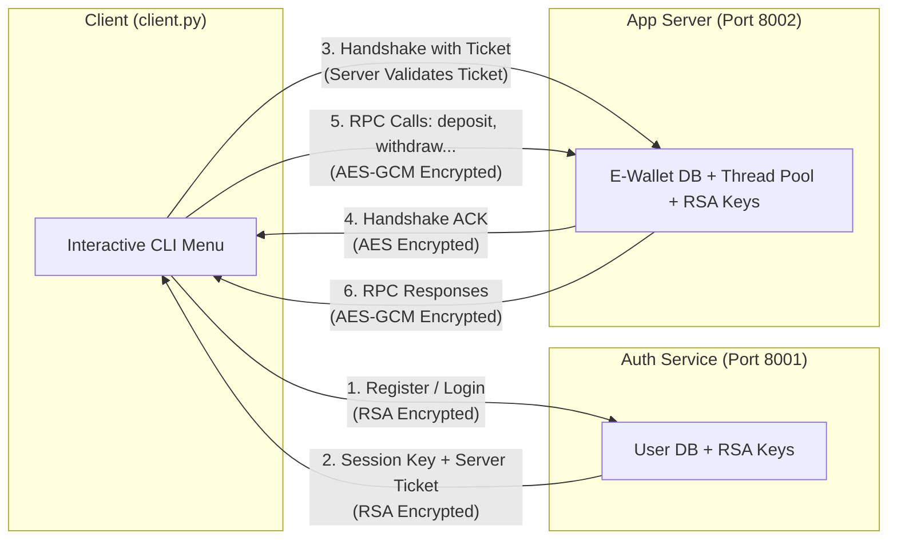
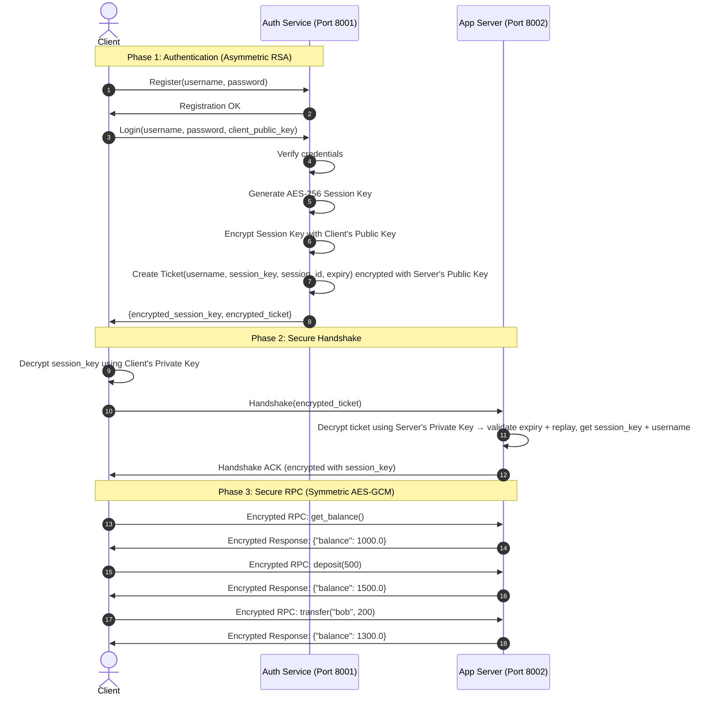

# Secure Distributed E-Wallet System — RPC with Encrypted Authentication

A distributed E-Wallet banking system built with pure Python sockets, multi-threading, and a hybrid RSA + AES encryption scheme for the **Introduction to Parallel and Distributed Systems** course.

## Architecture Overview

### Chosen Architecture Recommendation

The system will use a separate **Authentication Service** and **Application Server**. The client does not directly access the App Server just because it has a key. Instead, the client must first authenticate with the Authentication Service and receive a valid encrypted ticket.

Recommended flow:

```text
Client
  |
  |-- register/login --> Authentication Service
  |                      - verifies username/password
  |                      - creates AES session key
  |                      - creates encrypted ticket for App Server
  |
  |-- ticket + RPC calls --> App Server
                         - verifies ticket
                         - accepts encrypted RPC requests
```

This project uses a **hybrid encryption approach**:

- **Asymmetric encryption (RSA):** Used during authentication and secure exchange of the AES session key.
- **Symmetric encryption (AES-GCM):** Used after authentication for fast encrypted RPC communication between the client and App Server.

This design satisfies the project requirement for RPC with an Authentication Service using encryption, while keeping authentication separate from business operations.





## Technology Stack

| Component | Technology | Why |
|:---|:---|:---|
| Language | **Python 3.10+** | Cross-platform, readable, great for academic projects |
| Networking | **`socket`** (stdlib) | Raw TCP sockets — shows low-level distributed communication |
| Parallelism | **`threading`** + **`socketserver.ThreadingTCPServer`** | Multi-threaded server handling concurrent clients |
| Asymmetric Crypto | **RSA-2048 (OAEP)** via `cryptography` lib | Secure key exchange during authentication |
| Symmetric Crypto | **AES-256-GCM** via `cryptography` lib | Fast, authenticated encryption for RPC payloads |
| Serialization | **JSON** (stdlib) | Human-readable message format |
| Password Hashing | **PBKDF2-HMAC-SHA256** (stdlib `hashlib`) | Salted, slow password hashing suitable for this course demo |

> [!NOTE]
> The only external dependency is the `cryptography` library (`pip install cryptography`). Everything else uses Python's standard library.

## Security Notes and Demo Assumptions

- This project is an academic secure-RPC demonstration, not production banking software.
- Public keys are assumed to be trusted or pinned for the demo. In a real deployment, the client would need certificate validation or another trusted key distribution mechanism.
- Every AES-GCM encryption must use a fresh random 96-bit nonce. A nonce must never be reused with the same session key.
- Authentication tickets must include an expiry time and a random session ID/nonce so the App Server can reject expired or replayed tickets.
- Passwords must be stored with a unique salt and PBKDF2-HMAC-SHA256 iterations, not plain SHA-256.

## Project File Structure

```
Project IPDS/
├── common/                     # Shared utilities
│   ├── __init__.py
│   ├── crypto.py               # RSA + AES wrapper functions
│   └── rpc_protocol.py         # TCP message framing & JSON serialization
│
├── auth_service/               # Authentication Service (Port 8001)
│   ├── __init__.py
│   └── auth_server.py          # User registration, login, ticket generation
│
├── app_server/                 # Application Server (Port 8002)
│   ├── __init__.py
│   └── server.py               # E-Wallet RPC methods + thread-safe balance DB
│
├── client/                     # Client Application
│   ├── __init__.py
│   └── client.py               # Auth flow + RPC proxy + interactive CLI menu
│
├── keys/                       # Auto-generated RSA key files (created at runtime)
│   ├── auth_private.pem
│   ├── auth_public.pem
│   ├── server_private.pem
│   ├── server_public.pem
│   ├── client_private.pem
│   └── client_public.pem
│
├── requirements.txt            # Python dependencies (just `cryptography`)
└── run_demo.py                 # Master launcher script
```

---

## Proposed Changes — Step by Step

### Step 1: Common Module

#### [NEW] [crypto.py](common/crypto.py)

Contains all cryptographic wrapper functions:

- **RSA Key Management:**
  - `generate_rsa_keypair()` → Returns `(private_key, public_key)` objects
  - `save_key_to_pem(key, filepath)` → Saves key to `.pem` file
  - `load_private_key(filepath)` → Loads RSA private key from file
  - `load_public_key(filepath)` → Loads RSA public key from file
  - `serialize_public_key(public_key)` → Converts public key to PEM bytes (for sending over network)
  - `deserialize_public_key(pem_bytes)` → Reconstructs public key object from PEM bytes

- **RSA Encrypt/Decrypt (Asymmetric):**
  - `rsa_encrypt(public_key, plaintext_bytes)` → Encrypts data with recipient's public key (OAEP padding)
  - `rsa_decrypt(private_key, ciphertext_bytes)` → Decrypts data with own private key

- **AES-GCM Encrypt/Decrypt (Symmetric):**
  - `generate_session_key()` → Returns 32-byte random AES-256 key
  - `aes_encrypt(session_key, plaintext_bytes)` → Uses a fresh random 96-bit nonce and returns `nonce + ciphertext + tag` (authenticated encryption)
  - `aes_decrypt(session_key, encrypted_bytes)` → Decrypts and verifies authenticity, returns plaintext

- **Password Hashing:**
  - `hash_password(password)` → Generates a unique salt and returns a PBKDF2-HMAC-SHA256 password record
  - `verify_password(password, stored_record)` → Recomputes the password hash and compares it safely

#### [NEW] [rpc_protocol.py](common/rpc_protocol.py)

Handles TCP message framing and JSON serialization:

- `send_message(sock, data_dict)` → Serializes dict to JSON, prepends 4-byte length header, sends over socket
- `recv_message(sock)` → Reads 4-byte length header, reads exact number of bytes, deserializes JSON
- `send_raw(sock, raw_bytes)` → Sends raw bytes with length header (for encrypted payloads)
- `recv_raw(sock)` → Receives raw bytes with length header
- Request format: `{"action": "deposit", "args": {"amount": 500.0}}`
- Response format: `{"status": "success", "data": {"balance": 1500.0}}` or `{"status": "error", "message": "..."}`

---

### Step 2: Authentication Service

#### [NEW] [auth_server.py](auth_service/auth_server.py)

Multi-threaded TCP server on port **8001**:

- **User Database:** In-memory dictionary `{ username: password_record }` protected by a `threading.Lock()`
- **RSA Keys:** Generates or loads its own RSA keypair on startup. Also loads the App Server's public key (to encrypt tickets).
- **Endpoints (actions):**
  - `get_public_key` → Returns the Auth Server's public key (so the client can encrypt login credentials)
  - `register` → Receives `{username, password}`, stores a salted PBKDF2-HMAC-SHA256 password record in DB
  - `login` → Receives `{username, password, client_public_key}`:
    1. Verifies credentials against stored hash
    2. Generates a random AES-256 **Session Key**
    3. Creates a **Ticket** = `{"username": "alice", "session_key": <base64>, "session_id": <random>, "issued_at": <unix_time>, "expires_at": <unix_time>}` → encrypted with **App Server's Public Key**
    4. Encrypts the **Session Key** with the **Client's Public Key**
    5. Returns `{encrypted_session_key, encrypted_ticket}` to the client

---

### Step 3: Application Server (E-Wallet)

#### [NEW] [server.py](app_server/server.py)

Multi-threaded TCP server on port **8002** using `socketserver.ThreadingTCPServer`:

- **RSA Keys:** Generates or loads its own RSA keypair on startup
- **E-Wallet Database:** In-memory dictionary `{ username: balance }` protected by `threading.Lock()` for thread-safe concurrent access
- **Handshake Phase:**
  - Client sends the encrypted **Ticket**
  - Server decrypts it using its Private Key → extracts `username`, `session_key`, `session_id`, and expiry metadata
  - Server rejects expired tickets and remembers used `session_id` values to prevent replay
  - Server sends an ACK message encrypted with the `session_key` to confirm
- **RPC Methods (all encrypted with AES-GCM using the session key):**

| Method | Args | Description |
|:---|:---|:---|
| `get_balance` | — | Returns the current balance of the authenticated user |
| `deposit` | `amount` | Adds money to the user's account (thread-safe) |
| `withdraw` | `amount` | Subtracts money if sufficient funds exist (thread-safe) |
| `transfer` | `to_user`, `amount` | Moves money from authenticated user to another user (thread-safe, locks both accounts) |

- **Concurrency:** Each client connection is handled in its own thread. Thread locks ensure that no two threads can modify the same balance simultaneously.

---

### Step 4: Client

#### [NEW] [client.py](client/client.py)

Interactive CLI client:

- **Key Generation:** Generates its own RSA keypair on startup
- **Auth Flow:**
  1. Connects to Auth Server (port 8001)
  2. Fetches Auth Server's public key and verifies it against the demo's trusted/pinned key
  3. Sends registration or login request
  4. Receives encrypted session key + encrypted ticket
  5. Decrypts session key using Client's private key
- **App Server Flow:**
  1. Connects to App Server (port 8002)
  2. Sends the encrypted ticket (handshake)
  3. Receives AES-encrypted ACK
  4. Now all RPC calls use AES-GCM encryption
- **Interactive Menu:**
  ```
  ╔══════════════════════════════════════╗
  ║     Secure E-Wallet System          ║
  ╠══════════════════════════════════════╣
  ║  1. Register New Account            ║
  ║  2. Login                           ║
  ║  3. Check Balance                   ║
  ║  4. Deposit                         ║
  ║  5. Withdraw                        ║
  ║  6. Transfer                        ║
  ║  7. Show Encryption Debug Info      ║
  ║  8. Exit                            ║
  ╚══════════════════════════════════════╝
  ```
- **Debug Mode (Option 7):** Prints the raw encrypted bytes being sent/received over the socket, proving to the professor that data is truly encrypted.

---

### Step 5: Launcher & Dependencies

#### [NEW] [run_demo.py](run_demo.py)
- Generates all RSA keys if they don't exist
- Starts Auth Server in a background thread
- Starts App Server in a background thread
- Launches the interactive Client in the foreground

#### [NEW] [requirements.txt](requirements.txt)
```
cryptography
```

---

## Verification Plan

### Automated Tests (run during development)
1. `pip install cryptography` — verify dependency installs
2. Run `run_demo.py` and perform:
   - Register user "alice" with password "password123"
   - Register user "bob" with password "password456"
   - Login as "alice" — verify session key + ticket are received
   - Check balance — verify initial balance is returned
   - Deposit 500 — verify balance increases
   - Withdraw 200 — verify balance decreases
   - Transfer 100 to "bob" — verify alice's balance decreases and bob's increases
   - Attempt withdraw of more than balance — verify error is returned
   - Option 7 (debug) — verify encrypted ciphertext bytes are printed

### Error Handling Tests
- Attempt duplicate registration — verify an error is returned
- Attempt login with an invalid password — verify login is rejected
- Attempt deposit with a negative amount — verify an error is returned
- Attempt withdraw with a negative amount — verify an error is returned
- Attempt transfer to a missing user — verify an error is returned
- Send tampered AES ciphertext — verify decryption fails and the request is rejected

### Concurrency Test
- Run multiple client instances simultaneously to prove the server handles parallel connections with thread-safe balance operations
- Run concurrent deposits, withdrawals, and transfers for the same account to prove final balances remain correct

### Security Verification
- Use the debug output to show raw ciphertext on the wire
- Demonstrate that without the session key, the intercepted data is unreadable
- Reuse an old ticket — verify the App Server rejects it as a replay
- Use an expired ticket — verify the App Server rejects it
- Confirm AES-GCM uses a different nonce for each encrypted message
